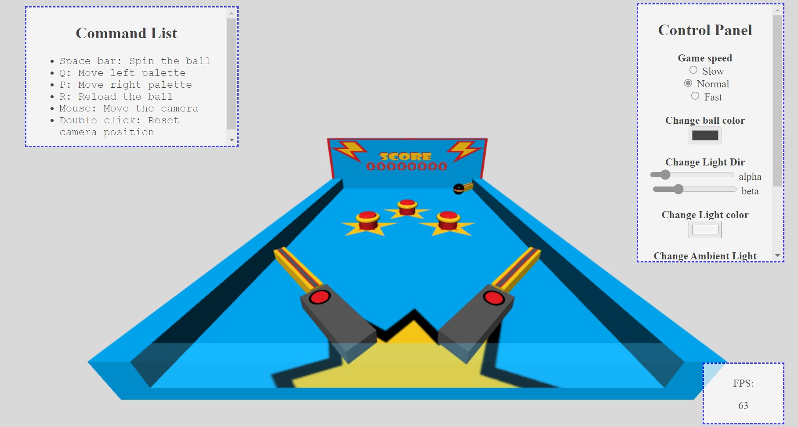

# Pinbaudo
3D Pinball game using WebGL, implementing Ray Collision Detection.


## Get started
```
docker run -p 8080:80 fsemeraro96/pinbaudo:v0
```
then connect to ```localhost:8080``` to start playing.
